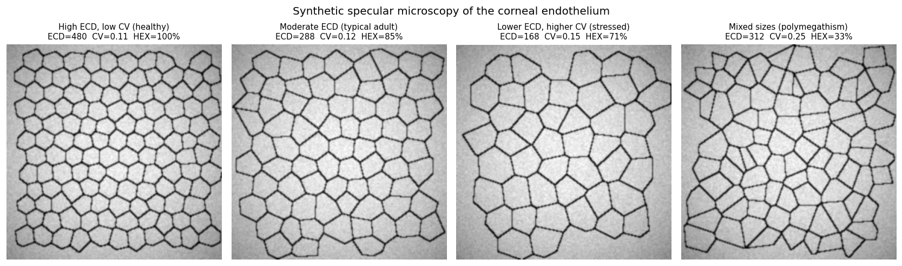
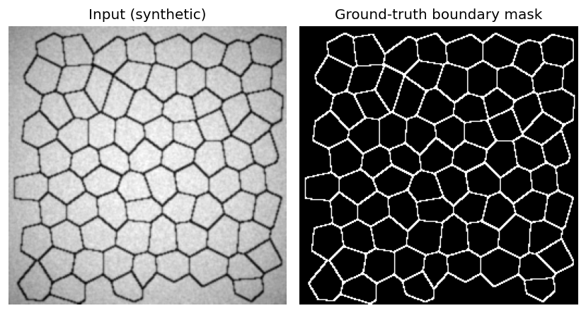
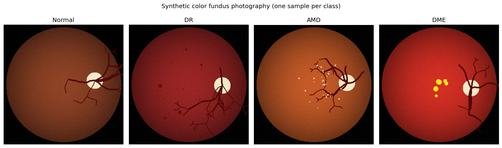

# AI & Computer Vision for Ophthalmic Imaging

Demonstration pipelines for two core computer-vision tasks performed at
ophthalmic image reading centers that support multicenter clinical trials:

1. **Corneal endothelial cell morphometry** segmenting individual endothelial
   cells in specular microscopy images and computing the three clinical metrics
   used in cornea reading: **ECD** (cell density), **CV** (coefficient of
   variation of cell area), and **HEX%** (percent hexagonal cells).

2. **Retinal disease classification from color fundus photography** a
   four-class classifier (Normal / DR / AMD / DME) with standard fundus
   preprocessing (circular crop, green-channel CLAHE, ImageNet normalization).

Each module is self-contained: it **generates its own synthetic data**,
preprocesses it, trains a model, and reports metrics + a visual demo. No
private clinical data is used. The goal is illustrative, to show the full
pipeline a reading center would deploy, end to end.

## Sample data

### Corneal endothelium (specular microscopy)

Synthetic specular-microscopy images produced by `cornea/generate_data.py`.
Varying seed-spacing and jitter simulates a realistic range of clinical
morphometry — from healthy, uniform hexagons to stressed endothelium with
polymegathism (high CV) and pleomorphism (low HEX%):



Each image comes with a ground-truth boundary mask that the U-Net learns to
reproduce:



### Retina (color fundus)

Synthetic color fundus images produced by `retina/generate_data.py`, one per
class. Red dots = microaneurysms / hemorrhages (DR). Pale-yellow small
drusen near the macula (AMD). Bright-yellow hard-exudate clusters near the
macula (DME):



## Repository layout

```
.
├── README.md
├── requirements.txt
│
├── cornea/                       Endothelium morphometry
│   ├── README.md                 features, targets, pipeline detail
│   ├── generate_data.py          Voronoi-based synthetic specular microscopy
│   ├── preprocess.py             CLAHE + normalization + augmentation
│   ├── model.py                  small U-Net + BCE + Dice loss
│   ├── morphometry.py            watershed -> ECD / CV / HEX%
│   └── train.py                  end-to-end training + inference demo
│
└── retina/                       Fundus disease classification
    ├── README.md                 features, targets, pipeline detail
    ├── generate_data.py          synthetic fundus with class-specific lesions
    ├── preprocess.py             circular crop + green-CLAHE + ImageNet norm
    ├── model.py                  ResNet-18 with replaced classification head
    └── train.py                  end-to-end training + evaluation
```

## Quick start

```bash
pip install -r requirements.txt

python cornea/train.py        # generates data, trains U-Net, reports ECD/CV/HEX%
python retina/train.py        # generates data, trains ResNet-18, reports F1/acc
```

Both scripts run on CPU in a few minutes for the default configuration, and
each writes a demo figure and a metrics file to an `outputs/` directory.

## Technical highlights

### Cornea pipeline
- **Synthesis.** 2D Voronoi tessellation of jittered hexagonal-grid seeds —
  captures plausible polymegathism (CV) and pleomorphism (HEX%) by varying the
  seed jitter. Standard surrogate for specular microscopy of the corneal
  endothelium.
- **Model.** U-Net (4 down / 4 up, 16 base channels) trained on a combined
  **BCE + Dice** loss, Dice is essential because boundary pixels are only
  ~5% of the image.
- **Instance segmentation.** Boundary probability → distance transform →
  local-maxima seeds → **watershed** → per-cell label map. Cells touching the
  image border or outside `[mean ± 3σ]` area are discarded.
- **Morphometry.** `skimage.measure.regionprops` for per-cell area + neighbor
  count (via 1-pixel binary dilation). Aggregated to ECD (cells/mm²), CV,
  and HEX%.

### Retina pipeline
- **Synthesis.** Circular FOV with optic disc, recursive vessel tree, and
  class-specific lesions (red microaneurysms / hemorrhages for DR; pale-yellow
  drusen near the macula for AMD; bright-yellow exudates near the macula for
  DME).
- **Preprocessing.** Circular crop (remove camera borders so the model does
  not memorize per-device geometry), CLAHE on the green channel (highest
  vessel/lesion contrast), resize to 224 × 224, ImageNet normalization.
- **Model.** ResNet-18 pretrained on ImageNet, final fully-connected layer
  replaced with a 4-class head. Cross-entropy loss, horizontal-flip
  augmentation, Adam optimizer.

## Evaluation

| Task                         | Metrics                                              |
|------------------------------|------------------------------------------------------|
| Cornea boundary segmentation | Dice; MAE on ECD / CV / HEX% vs ground truth         |
| Retina 4-class classification| Accuracy; per-class F1; confusion matrix             |

On the synthetic data, the defaults give:

- Cornea (200 train / 40 test / 15 epochs): Dice > 0.85, ECD MAE a few cells/mm²
- Retina (60 train per class / 8 epochs, ImageNet-pretrained): accuracy ~95%+

## Requirements

- Python 3.9+
- PyTorch, torchvision, NumPy, SciPy, scikit-image, scikit-learn, OpenCV,
  Matplotlib, Pillow, tqdm

See `requirements.txt` for exact minimums.

## License

This repository is a technical demonstration using synthetic data only. No
patient data or clinical imagery is included.
